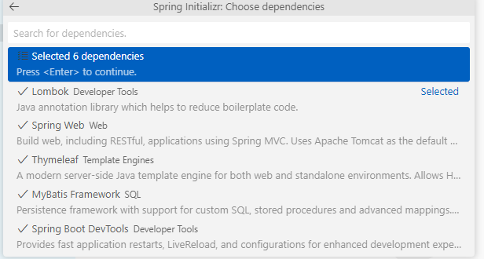

# 目次

- [目次](#目次)
  - [大事なこと](#大事なこと)
    - [リポジトリ作成方法](#リポジトリ作成方法)
  - [Spring Boot](#spring-boot)
    - [導入](#導入)

## 大事なこと

### リポジトリ作成方法

1. GitHubで作成
2. VSCodeでCtrl + Shift + P
3. Git Clone
4. GithubからPATHをコピペ
5. ローカル作業フォルダに複製

## Spring Boot

###  導入

1. コマンドパレットからSpring Initializr: Create a Maven Projectを選択
2. Group/Artifact/Version/Description/Package
   - パッケージの形式はJar
3. 依存関係  
